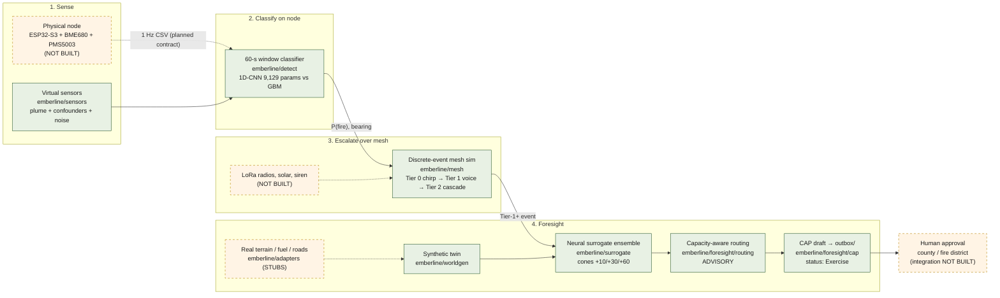

# Emberline — the idea on one page

> **Status line, read first.** Everything that runs in this repository is a
> software simulation on synthetic worlds. The hardware node, the radio mesh,
> real sensor data and every partnership named below are **NOT BUILT** or
> **PLANNED**, and are labelled as such. Measured numbers come from
> [REPORT.md](../REPORT.md) and are summarised in [03_RESULTS.md](03_RESULTS.md).
> What is missing is itemised in [04_GAP_REGISTER.md](04_GAP_REGISTER.md).

## The problem: detection is not the failure mode

In the 2023 Lahaina fire the fire was detected. More than a hundred people
still died, because the things that carry a warning to a person failed at the
moment they were needed: grid power, cell service, and the siren system.
*(Business/hardware context supplied by the team; not derived from this repo.)*

Every incumbent in wildfire tech ends in an internet notification: Dryad
Silvanet, Torch, Pano AI cameras, satellite products. They are detection
businesses. Their last mile assumes the network that Lahaina lost.

Emberline's uncontested claim is therefore **infrastructure-independent
last-mile warning**, not detection. The system should still wake a
neighbourhood when the internet, the cell towers and the grid are all down.

## What Emberline is

A "neighbourhood smoke alarm" for the wildland-urban interface (WUI):

1. **Sense.** Solar mesh sensor nodes on consented private property read
   particulate matter, gas resistance, temperature and humidity at 1 Hz.
   *(PLANNED hardware: ESP32-S3 + BME680/688 + PMS5003, prototype BOM ≈ $106;
   see [04_GAP_REGISTER.md](04_GAP_REGISTER.md).)*
2. **Classify on the node.** A small classifier decides, from a 60-second
   window, whether the signature is fire smoke or a confounder (barbecue, wood
   stove, vehicle, fog, dust, aerosol). *(Built and measured on synthetic
   windows; see [03_RESULTS.md](03_RESULTS.md).)*
3. **Escalate over a self-healing LoRa mesh.** Nodes corroborate each other
   over a low-power radio mesh with no dependency on infrastructure, and sound
   a graded warning. *(Built as a discrete-event simulation; real radios NOT
   BUILT.)*
4. **Forecast with Foresight.** A physics-trained neural surrogate rolls a
   Monte Carlo ensemble forward to draw probability cones at +10/+30/+60 min,
   routes evacuation traffic around the cone with capacity awareness, and
   drafts a Common Alerting Protocol (CAP) message for a human to approve.
   *(Built and measured on synthetic worlds; real terrain, roads and county
   integration NOT BUILT.)*

## The escalation ladder (alert authority model)

Confidence rises in three tiers so that a single hot sensor cannot wake a
town, and a corroborated fire cannot be silenced by a missing router.

| tier | trigger (as implemented in `emberline/mesh/escalation.py`) | what a resident hears |
|---|---|---|
| **Tier 0 — chirp** | one node, classifier confidence ≥ 0.60 | local chirp at that node only; cheap to be wrong |
| **Tier 1 — voice + bearing** | one healthy node sustaining ≥ 0.85 twice ≥ 20 s apart, **or** two nodes whose health-weighted confidence sum ≥ 1.20 | voice alert with a bearing ("smoke, bearing two-two-five") |
| **Tier 2 — full cascade** | ≥ 2 distinct nodes and weighted score ≥ 1.60 within a 120-s window | every reachable node sirens; Foresight is triggered |

Degraded nodes (low battery, drifted baseline) carry a weight floor of 0.2, so
they can contribute but never trigger a cascade on their own. The mesh elects
a cluster head, heartbeats, and re-elects when the head goes silent.

Nodes sit on consented private property. Any **official** county alert keeps a
human approve step: Foresight writes a CAP-format draft to an outbox and
nothing in the system transmits it. *(The draft and outbox are built; the
county/IPAWS path is NOT BUILT.)*

## Why the uncontested space is warning delivery

- Detection is crowded and improving without us (cameras, satellites, other
  sensor networks).
- The last mile is where Lahaina failed and where none of the incumbents
  compete, because their product architecture ends at a cloud API.
- A mesh that carries its own siren and its own power is valuable *even if*
  detection comes from somewhere else: it is the delivery layer.
- The business consequence *(PLANNED, unvalidated)*: insurers and utilities
  exposed to WUI losses subsidise deployments; residents pay nothing; fire
  districts and county emergency managers are partners, not payers.
  Government-first procurement was rejected after review as too slow.

## What exists today

A tested, reproducible simulation of the whole chain on procedurally
generated 2.56 km × 2.56 km worlds: fractal terrain, fuel, a town with roads
and 315 buildings, gusting wind; a Rothermel-inspired cellular-automaton fire
model; a 371,858-parameter UNet surrogate trained on 16,841 synthetic fire
pairs; a Gaussian-plume sensor model with six authored confounders; a
9,129-parameter 1D-CNN smoke classifier and a gradient-boosted baseline; a
discrete-event LoRa-class mesh with the three-tier ladder; Foresight cones,
routing and CAP drafts; a scripted demo; a hindcast harness; stress tests.

Headline measured numbers (all synthetic; full tables and gaps in
[03_RESULTS.md](03_RESULTS.md)):

| what | measured |
|---|---|
| surrogate burned-area IoU at +30 min, unseen worlds / held-out wind regime | 0.627 / 0.657 (target was 0.80: **missed**) |
| surrogate ensemble calibration (ECE, raw, shipped) | 0.060 |
| surrogate ensemble speedup vs the repo's own fast physics | 0.5× (target 100×: **missed**; the baseline is a toy CA) |
| smoke detection F1 on held-out events, CNN / GBM | 0.943 / 0.952 (the CNN **did not beat** the baseline) |
| single-node false positives on a confounder-rich ambient day | 7.33 per node-day (CNN) |
| detection latency from plume arrival, median | 36 s |
| canonical demo: ignition → Tier-0 / Tier-1 / Tier-2 | 30 s / 120 s / 300 s |
| hindcast warning minutes gained vs authored 911 call (6 scenarios) | +19.5, +7.5, −6.5, and three misses |

## What is next

1. One real node streaming 1 Hz CSV, filmed at a supervised burn, with a
   classifier retrained on real, event-labelled sessions (**NOT STARTED** in
   code; contract defined in [02_DATA_PIPELINE.md](02_DATA_PIPELINE.md)).
2. A 3–5 node LoRa field test to replace the radio model with measurements.
3. A pilot community, an insurer conversation, and real hindcasts through the
   adapters that are currently stubs.

Full sequence in [05_ROADMAP.md](05_ROADMAP.md).

## System diagram

Solid boxes are built and tested in this repository as simulation. Dashed
boxes are PLANNED or NOT BUILT.

Source: [diagrams/system.mmd](diagrams/system.mmd). PNG for slides:
[diagrams/system.png](diagrams/system.png).

---

Next: [01_ARCHITECTURE.md](01_ARCHITECTURE.md) — how the software actually
works, module by module. Index: [README.md](../README.md).
