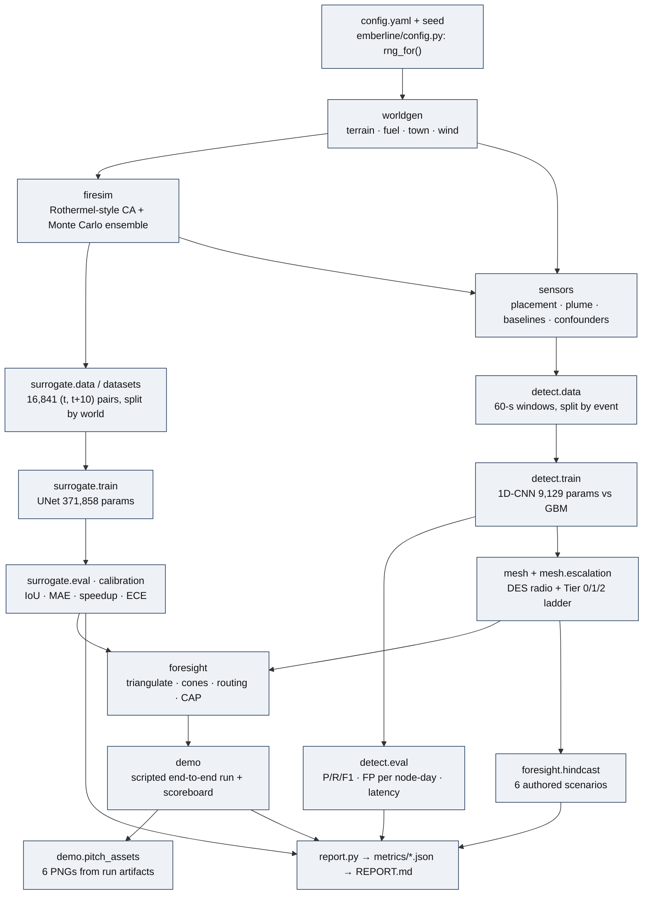
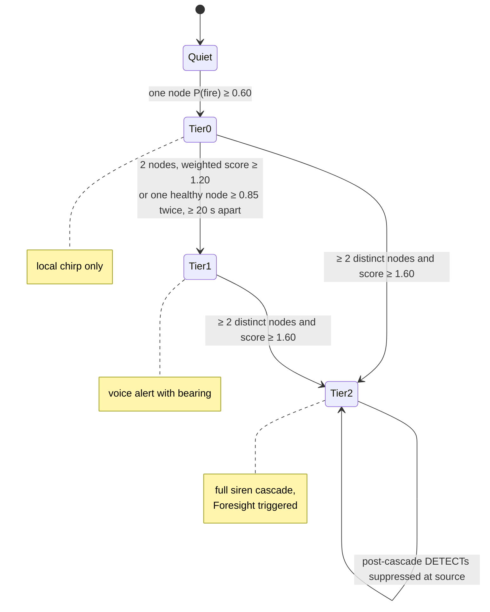

# Emberline software architecture

How the simulation works, module by module, in execution order, mapped to the
code as it actually is. Every equation below is quoted or paraphrased from the
module docstring named next to it. Every knob is a key in
[config.yaml](../config.yaml). The inventory with test coverage per module is
[AUDIT.md](AUDIT.md).

Everything here is simulation. Where a module stands in for something
physical (a sensor, a radio, terrain data), that is stated and the gap is
tracked in [04_GAP_REGISTER.md](04_GAP_REGISTER.md).

## Execution order



Source: [diagrams/architecture_modules.mmd](diagrams/architecture_modules.mmd).

### Determinism

`emberline/config.py` loads one YAML and derives every random stream from the
single `seed: 1337` with `rng_for(cfg, stream_name, extra)`, which keys a
`numpy.random.SeedSequence` on the seed, a hash of the stream name and an
optional integer (usually a world id). Re-running any stage with the same
config reproduces its outputs; the surrogate dataset has been regenerated
byte-identically on two machines (16,841 pairs both times, per PROGRESS.md).
Torch CPU kernels are *not* bit-identical across platforms, so trained-model
evaluations drift slightly between machines; REPORT.md keeps both records.

---

## 1. `emberline/worldgen/` — the synthetic world

**Inputs:** `config.yaml → world.*`, a `world_id`.
**Outputs:** a `World` dataclass: `elevation (256×256 m)`, `fuel (int8 codes)`,
`town` (networkx road graph, buildings with access nodes, exit nodes),
`wind` (`WindModel`), `cell_m = 10`.

| piece | mechanism (from docstrings) | config keys |
|---|---|---|
| `terrain.py` | spectral synthesis: white noise → FFT → amplitude ∝ \|k\|^(−β/2) so power ∝ \|k\|^−β; normalised to `relief_m` | `world.grid_size`, `world.cell_m`, `world.elevation.relief_m`, `.beta` |
| `fuel.py` | water = lowest-elevation quantile; land split into grass/brush/timber by quantiles of a second fractal field biased by +0.6·(normalised elevation) so timber bands uphill; roads and buildings become urban | `world.fuel.grass/brush/timber`, `.water_level_quantile`, `.cluster_beta` |
| `town.py` | district placed on the flattest, driest 72-cell window; street lattice every 6 cells; `n_exits` straight exit roads to distinct map edges; 150–400 single-cell buildings on lots adjacent to streets, each with its nearest road node as `access` | `world.town.*` |
| `wind.py` | spatially uniform vector; speed and direction each follow an Ornstein–Uhlenbeck deviation `x_{k+1} = x_k(1 − dt/τ) + σ√(2dt/τ)·N(0,1)` around a piecewise-constant mean; `apply_shift(t, Δdir, Δspeed)` edits the mean from t onward without touching the gust path | `world.wind.base_speed_ms`, `.base_dir_deg`, `.gust_sigma`, `.dir_sigma_deg`, `.ou_tau_s`, `.regime_shifts` |

`world_id = 0` is the canonical demo world (315 buildings, 3 exits, wind
8 m/s toward 225°). Ids ≥ 1 draw a random base wind direction (0–360°) and
speed (2–14 m/s) for surrogate training diversity.

**Stand-in for:** real terrain (USGS 3DEP), fuel (LANDFIRE), roads/buildings
(OpenStreetMap). The adapters in `emberline/adapters/` define the array
contracts and raise `NotImplementedError`.

---

## 2. `emberline/firesim/` — the physics teacher

**Inputs:** a `World`, an RNG, an optional `FirePerturbation`.
**Outputs:** per-cell state (0 unburned, 1 burning, 2 burned), arrival minute
per cell; `run_ensemble` returns `P(burned by horizon)` maps.

From the `firesim/__init__.py` docstring:

- Rate of spread `ROS = R0 · φ_fuel · φ_wind · φ_slope`.
- `φ_slope = 1 + 5.275·tan²φ` upslope (Rothermel's slope factor); the
  reciprocal damps downslope spread.
- `φ_wind = 1 + wind_c · U^wind_b · cos θ` downwind, reciprocal upwind, where
  θ is the angle between wind and spread direction (gives elliptical fires).
- Per timestep a burning cell ignites each unburned 8-neighbour with
  `p = 1 − exp(−ROS · dt / d)`, `d` = 10 or 14.14 m (exact for Poisson
  arrivals at rate ROS/d).
- Static per-direction fields (fuel × slope × dt/d) are precomputed, so a
  step is eight vectorised exponentials; 60 sim-minutes runs in well under a
  second (`test_speed_60min_under_5s`).
- Residence times: grass 90 s, brush 180 s, timber 300 s, urban 240 s.
  Urban cells add a Bernoulli ignition gate; water has factor 0.

**Stated limits (docstring):** surface spread only — no crown fire, no ember
spotting, no fire–atmosphere coupling, no fuel-moisture dynamics,
quasi-steady ROS, 10 m cells, spatially uniform wind.

`firesim/ensemble.py`: each member perturbs ignition (Gaussian jitter,
modelling bearing uncertainty), mean wind direction and speed (forecast
error) and enables per-cell lognormal ROS roughness (`spread_stochasticity`).
The fraction of members in which a cell has ignited by horizon *t* is the
probability cone.

Config: `firesim.dt_s`, `.r0_ms`, `.fuel_factor.*`, `.urban_ignition_prob`,
`.wind_c`, `.wind_b`, `.slope_c`, `.spread_stochasticity`, `.ensemble.*`.

---

## 3. `emberline/surrogate/` — neural forecaster (training + ensemble inference)

**Inputs (one step):** 10 planes at time *t*: `touched`, `burning`, normalised
elevation, fuel one-hot (5), wind u and v as constant planes.
**Output:** logits for `touched` and `burning` at *t + 10 min*.

| piece | mechanism | config keys |
|---|---|---|
| `data.py` | streams physics fires: 160 worlds × 16 fires × up to 20 ten-minute snapshots; upwind-biased 2×2 ignitions (uniform placement wasted about half the runs at map edges); early stop when the fire dies or touches the edge; one compressed shard per world; resumable and byte-deterministic; worlds whose base wind direction falls in 80–130° are tagged as the held-out regime | `surrogate.dataset.n_worlds`, `.fires_per_world`, `.snapshots_per_fire`, `.dir`, `.holdout_wind_regime.*` |
| `datasets.py` | split **by world** (last 20 % of usable ids → val; held-out regime → eval only); 64×64 crops centred near a random front cell with ±10-cell jitter; Phase-9 augmentation rotates terrain, fuel, fire and the wind vector by the **same** random angle (order-0 resampling keeps masks binary and one-hot; bilinear for elevation); 25 % of samples stay on the native grid | `surrogate.train.crop`, `.val_world_frac`, `.rotate_augment`, `.rotate_keep_frac`, `.oversample_early` |
| `model.py` | `FireUNet`: 3-level UNet, base 24 channels, GroupNorm + SiLU, stride-2 down, bilinear up, skip connections; **371,858 params**, hard cap 5 M asserted; `rollout_step` thresholds at 0.5 and clamps `touched := max(touched, prev)` so burned cells never unburn | `surrogate.model.base_channels` |
| `train.py` | loss = BCE on both planes + soft Dice on `touched`; Adam; val IoU@+10 on crops every 200 steps; `best.pt` / `latest.pt`; resume; `--init-from` warm start for fine-tuning; early stopping after 6 flat checks | `surrogate.train.batch_size`, `.lr`, `.max_steps`, `.val_every`, `.checkpoint_every`, `.early_stop_patience`, `.dir` |
| `rollout.py` | `SurrogateEngine.rollout` steps a single fire autoregressively (+30 = 3 steps, +60 = 6); `SurrogateEngine.ensemble` runs **all members as one batch** through the network per 10-min step, with the same perturbation model as physics; this batching is where any speedup comes from | `firesim.ensemble.*` (shared) |
| `eval.py` | IoU of the touched mask at +10/+30/+60 vs physics on 64 val fires and 64 held-out-regime fires; 5th-percentile IoU@+30; arrival-time MAE over jointly touched cells; 20-member 60-min speedup benchmark; the surrogate receives the **true** wind sequence during rollout | `surrogate.eval.n_eval_worlds`, `.speedup_members` |
| `calibration.py` | reliability of 20-member P(burn by +30) vs physics on 12 val fires over near-fire cells; ECE; temperature `sigmoid(logit(p)/T)` fitted by NLL over *interior* frequencies only on fresh worlds 161–168 and required to improve ECE on disjoint worlds 169–172, else T = 1 ships | `foresight.temperature` (stays `null`) |

The shipped checkpoint `best.pt` is v2: fine-tuned from `best_v1.pt` with
rotation augmentation, early-stopped at step 2800 with the best crop IoU at
step 1600 (PROGRESS.md, Phase 9).

---

## 4. `emberline/sensors/` — virtual nodes, plume and confounders

**Inputs:** a `World`, burning cells per timestep, wind, confounder specs.
**Outputs:** 4-channel 1 Hz series per node: `pm25 (µg/m³)`, `voc (index)`,
`temp (°C)`, `rh (%)`.

- `place_nodes`: 70 % of nodes on a ring 150–350 m outside the town district,
  the rest as outposts 600–1100 m toward the prevailing upwind sector.
- `plume.py` (docstring): ground-level Gaussian plume with full reflection,
  `C = Q / (π σ_y σ_z U) · exp(−y² / 2σ_y²)`, `σ_y = 0.10·d`, `σ_z = 0.06·d`
  (first-order Pasquill–Gifford neutral fit), calm floor `U ≥ 0.5 m/s`,
  upwind receptors get zero; steady-state per step, flat transport, every
  burning cell an equal point source. `q_fire = 9000` was calibrated so a
  ~30-cell fire reads tens of µg/m³ at 300–900 m downwind.
- `baseline`: temperature sinusoid peaking at 16:00 (15 ± 8 °C); RH
  anti-correlated; PM2.5 8 µg/m³ with morning/evening traffic bumps; VOC
  ripple around 0.3.
- `sample_series`: baseline + event + Gaussian noise per channel + linear
  per-node PM drift (0.5 µg/m³ per day, random sign).
- `events.py`: six **authored** confounder envelopes (durations, amplitudes,
  node scope and channel behaviour in the module table); fire plume → PM with
  VOC at 1.5–3.5 % of PM.

Config: `sensors.n_nodes`, `.sample_hz`, `.plume.*`, `.noise.*`,
`.confounders`, `.window_s`.

**Stand-in for:** the physical node's 1 Hz CSV. The virtual channels do not
match the planned hardware channels (gas resistance in ohms, PM1/PM10,
pressure); see [02_DATA_PIPELINE.md](02_DATA_PIPELINE.md) §(d).

---

## 5. `emberline/detect/` — the on-node classifier

**Inputs:** `(4, 60)` raw window. **Output:** `P(fire smoke)`.

- `data.py`: 120 simulated fire events on 10 node layouts (worlds 300–309),
  up to 8 windows from each of the 3 most-exposed nodes, kept only where added
  PM ≥ 3 µg/m³; 240 confounder events (cycling the six kinds, stoves in the
  evening, fog before dawn); 2,000 ambient windows. Every window carries an
  `event_id`.
- `train.py`: `event_split` sends whole events to val (25 %); GBM = sklearn
  `GradientBoostingClassifier(150 trees, depth 3)` on `gbm_features`
  (per-channel mean/std/max/slope/last−first, VOC/PM ratio, RH mean,
  PM-slope × VOC-slope); CNN trained with pos-weighted BCE, early stopped on
  val F1; the CNN operating **threshold is chosen on train windows** (0.60).
- `model.py`: `SmokeCNN` = three Conv1d stages (24, 32, 48 channels) with
  SiLU and max-pooling, global average + max pooling concatenated, linear
  head; fixed physical-range normalisation so a node needs no calibration
  pass. The docstring commits in advance: if the CNN cannot beat the GBM, ship
  the cheaper model.
- `eval.py`: val precision/recall/F1 for both; per-confounder FP rate; a
  24-hour fire-free day with 14 confounder events across 12 nodes, classifier
  slid every 30 s → FP per node-day; detection latency over 25 fresh fires
  (seconds from plume ≥ 3 µg/m³ at the best node to the first positive
  window).

Config: `detect.dataset.*`, `detect.train.*`, `detect.threshold` (GBM 0.5).

---

## 6. `emberline/mesh/` — discrete-event LoRa-class mesh

**Inputs:** `World` (terrain for occlusion), node positions and health, a
mesh config, detections `(node, confidence, bearing)`.
**Outputs:** an event log, per-node siren tier, tier timestamps, transmission
and collision counts, channel utilisation.

Radio model (`mesh/__init__.py` docstring):

```
RSSI = P_tx − [PL0 + 10·n·log10(d / 1 m)] − k · max_intrusion_m
```

with `P_tx = 20 dBm`, `PL0 = 40 dB`, `n = 2.9` (semi-rural), `k = 0.08 dB/m`
of terrain poking above the straight ray between 3-m masts (24 samples), link
if `RSSI ≥ −129 dBm` (SF10-class). A note the demo makes visible: at
`n = 2.9` on a 2.56-km world every one of the 12 demo nodes hears every
other (degree 11, cascade max 1 hop). Multi-hop behaviour is exercised in
`tests/test_mesh.py` with a dense-canopy exponent of 4.5.

MAC model: flooding with duplicate suppression (`_seen` per node), random
backoff up to 800 ms, CAD listen-before-talk treating the whole mesh as one
collision domain (conservative), per-receiver overlap collisions destroying
both packets (no capture effect), 2 % independent packet loss, a hard 1 %
duty-cycle budget per node (`duty_budget_ms`), 400 ms airtime per data
packet and 80 ms per heartbeat.

Escalation (`mesh/escalation.py`, thresholds in `mesh.escalation.*`):

- `report_detection` drops anything below `tier0_conf = 0.60`, logs a Tier-0
  chirp, rate-limits DETECT packets to one per 30 s per node, weights the
  report by `clip(health, 0.2, 1.0)`.
- Health = `clip((battery_v − 3.0)/0.9) × clip(1 − drift_score)`.
- The cluster head (argmax of degree × health) ingests DETECTs and keeps the
  best report per origin inside a 120-s window.
- `score = Σ weight × confidence`; `distinct` counts origins with
  `weight × confidence ≥ 0.3`.
- Tier 2 if `distinct ≥ 2 and score ≥ 1.60`; Tier 1 if
  `distinct ≥ 2 and score ≥ 1.20` or one healthy node (weight ≥ 0.7) reported
  ≥ 0.85 at least twice ≥ 20 s apart (`_sustained_single`, added after a BBQ
  tail voice-alerted the whole town in development).
- Escalation floods an ALERT with the mean bearing; nodes that relayed a
  Tier-2 alert stop relaying lower-tier traffic (storm suppression).
- Heartbeats every 60 s; any node silent > 2.5 periods is mourned in the log;
  a silent head is replaced by re-election and a HEAD_ELECT flood.

Measured consequences of these rules (pinned by `tests/test_stress.py`,
documented in REPORT.md): a second fire reported after a cascade is dropped
at the source; an all-degraded mesh can chirp but never cascade.



Source: [diagrams/escalation_ladder.mmd](diagrams/escalation_ladder.mmd).

---

## 7. `emberline/foresight/` — twin, cones, routing, CAP

**Inputs:** the incident's detections (node positions + bearings), the
`World`, the surrogate engine (or physics fallback).
**Outputs:** ignition estimate, `Cone` (P(burn) per horizon), `RoutePlan`,
a CAP JSON draft in `outbox/`.

- `estimate_ignition`: with ≥ 2 bearings, least-squares intersection of
  bearing rays (up to 4); if the 2×2 system's condition number exceeds 10⁴,
  or with one bearing, project 400 m up the bearing. Bearings in the demo are
  derived as "upwind of the node" (`wind_dir + 180°`), not from any sensor.
- `Foresight.forecast`: `SurrogateEngine.ensemble` if `best.pt` exists, else
  `run_ensemble` (physics), 30 members, horizons 10/30/60 min, RNG keyed on
  the forecast time.
- `Cone`: `mask(h)` at the lowest threshold dilated by 4 cells; `union_mask`
  across horizons for the CAP polygon; `routing_mask(30 min, P ≥ 0.30)` for
  road cutting. The docstring records why: routing on the +60 low-probability
  cone stranded half the town in development.
- `routing.py`: remove road edges whose raster cells touch the routing mask;
  one vehicle per building at its access node; 3 rounds of A* with
  `cost = length · (1 + 0.15·(load/900)²)` (BPR-style); `static_fallback_plan`
  with no cone and no congestion is always available; `label` is always
  "ADVISORY - decision support only".
- `cap.py`: OASIS CAP 1.2-shaped JSON with `status: "Exercise"` always,
  `sender: emberline-foresight@simulation.invalid`, area = convex hull of the
  union cone in local metres; `validate_cap` checks required fields, enums and
  polygon closure; the draft is written to `outbox/` and **nothing transmits
  it**.
- `hindcast.py`: replays a scenario YAML through sensors → CNN → mesh and
  reports `warning_minutes_gained = report_911_min − tier2_min`, `None` when
  no cascade fired; generates the siting-implication sentences from the
  measured rows so text cannot disagree with the table.
- `economics.py`: payback arithmetic on illustrative config inputs; its
  REPORT section is not currently present and its metrics file is not
  committed.

Config: `foresight.cone_thresholds`, `.temperature`, `.cone_margin_cells`,
`.routing_horizon_min`, `.routing_threshold`, `.road_capacity_vph`,
`.ensemble_members`, `.horizons_min`; `economics.*`.

---

## 8. `emberline/demo/` — the scripted end-to-end run

`python -m emberline.demo --scenario ridgeline [--fast] [--wind-shift DEG] [--kill-node N3]`

Timeline of the canonical run (75 sim-minutes, 30-s steps, world 0, 12 nodes,
node N1 deliberately degraded to health 0.21):

1. 13:31 a barbecue starts 20 m from node N4; the classifier is polled at
   +4 and +7 min and the result is narrated (ignored, or held at Tier 0).
2. 13:39 hidden ignition on the highest burnable ground 550–900 m upwind;
   the banner "INTERNET: DOWN CELL: DOWN GRID: DOWN" is printed — from here
   the story only uses the mesh.
3. Every 30 s: physics steps; plume concentration at each node; 4-channel
   windows assembled from baseline + added + noise; `Classifier.confidence`;
   reports ≥ 0.60 go to `MeshProtocol.report_detection` with bearing = upwind;
   `mesh.run_until` advances the DES; log lines are narrated.
4. On Tier 1: `estimate_ignition` from the incident's bearings (error vs
   truth printed). On Tier 2: `Foresight.forecast` → frame → `plan_evacuation`
   on the routing mask → `draft_cap_alert` on the union mask.
5. `--kill-node`: 120 s after Tier 2 the node is killed; the mourning line
   appears when its heartbeats have been silent > 2.5 periods.
   `--wind-shift`: 600 s after Tier 2 the mean wind swings; re-forecast and
   re-plan, before/after exit loads and cut edges printed.
6. Frames every 5 sim-minutes → `demo/out/demo.gif`; raw arrays and plans →
   `demo/out/last_run_artifacts.{npz,json}`; event timings →
   `metrics/demo_last_run.json`; the scoreboard reads `metrics/surrogate.json`
   and `metrics/detect.json`.

`demo/pitch_assets.py` renders six 1920×1080 PNGs from those artifacts and
refuses to draw any asset whose source is missing.

### One ignition event, from first sample to CAP draft

```mermaid
sequenceDiagram
    autonumber
    participant FS as firesim.FireSim (truth)
    participant PL as sensors.plume
    participant N0 as node N0 (sensors + detect.SmokeCNN)
    participant N7 as node N7 (sensors + detect.SmokeCNN)
    participant MS as mesh.MeshSim (radio DES)
    participant HD as MeshProtocol cluster head (N0)
    participant FO as foresight (twin + surrogate)
    participant OB as outbox/ (human approval)

    FS->>PL: burning cells at t (30-s step)
    PL->>N0: PM2.5 contribution (Gaussian plume, downwind only)
    PL->>N7: PM2.5 contribution
    N0->>N0: 60-s window = baseline + plume + noise → P(fire)
    Note over N0: t+30 s  P(fire) ≥ 0.60 → Tier-0 chirp (local)
    N0->>MS: DETECT{conf, weight=health, bearing} (backoff, CAD, duty budget)
    MS->>HD: deliver (head hears itself directly)
    HD->>HD: score = Σ weight×conf over 120-s window
    Note over HD: t+90 s  sustained single healthy node ≥ 0.85 → Tier 1
    HD->>MS: ALERT{tier 1, mean bearing} flood
    MS-->>N7: voice alert with bearing (hop 1)
    N7->>N7: plume arrives, P(fire) ≥ 0.60
    N7->>MS: DETECT
    MS->>HD: deliver
    Note over HD: t+270 s  2 distinct origins, score 1.94 ≥ 1.60 → Tier 2
    HD->>MS: ALERT{tier 2} flood; relays suppress lower tiers
    MS-->>N0: FULL SIREN CASCADE
    MS-->>N7: FULL SIREN CASCADE
    HD->>FO: incident detections (positions + bearings)
    FO->>FO: estimate_ignition (least squares) → 248 m error
    FO->>FO: SurrogateEngine.ensemble 30 members → P(burn) +10/+30/+60
    FO->>FO: plan_evacuation on routing_mask(+30 min, P≥0.30) — ADVISORY
    FO->>OB: draft_cap_alert(status="Exercise", polygon = union cone)
    Note over OB: nothing transmits; a human must approve (county path NOT BUILT)
```

Timestamps are the canonical demo's measured values (`metrics/demo_last_run.json`:
Tier-0 30 s, Tier-1 120 s and Tier-2 300 s on the 30-s scenario clock; the
mesh log shows the escalations at 90 s and 270.5 s of mesh time). Source:
[diagrams/ignition_sequence.mmd](diagrams/ignition_sequence.mmd).

---

## 9. Reporting: `emberline/report.py`

Every measured number lives twice: as JSON under `metrics/` (read by the demo
scoreboard and the pitch assets) and as a marker-delimited section of
`REPORT.md` (`<!-- BEGIN name --> … <!-- END name -->`). Only
`update_section` writes REPORT.md, so `grep update_section` lists every code
path that can put a number in front of a reader.

---

Previous: [00_OVERVIEW.md](00_OVERVIEW.md). Next:
[02_DATA_PIPELINE.md](02_DATA_PIPELINE.md). Glossary:
[06_GLOSSARY.md](06_GLOSSARY.md).
