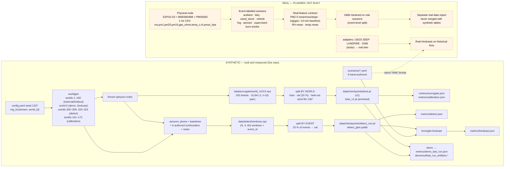

# Emberline data pipeline

Every dataset the system touches, where it comes from, and how it is split.
Three of the four pipelines below exist and run; the fourth is the **planned**
real-data pipeline and is labelled as such throughout.

**The boundary in one sentence:** every byte of data that has ever passed
through this repository was generated by this repository's own models from
`seed: 1337`. No real sensor reading, radio packet, map tile or fire record
has been ingested.

## Data-flow diagram



Source: [diagrams/data_flow.mmd](diagrams/data_flow.mmd). PNG for slides:
[diagrams/data_flow.png](diagrams/data_flow.png).

---

## (a) Synthetic fire pairs for the surrogate — BUILT

| item | value | where |
|---|---|---|
| generator | `python -m emberline.surrogate.data` (`generate_dataset`, parallel, resumable) | `emberline/surrogate/data.py` |
| worlds | ids 1–160 (`surrogate.dataset.n_worlds`); id 0 is never trained on | `config.yaml` |
| fires per world | 16, each a 2×2 ignition chosen as the most upwind of 8 random burnable candidates (≥ 30 cells from the edge) | `_random_ignition` |
| snapshots | every 10 sim-minutes, up to 20 per fire; stop early when the fire dies or touches the map edge | `generate_world_shard` |
| sample | `(t, t+10 min)` pair: 10 input planes, 2 target planes | `datasets.FirePairDataset` |
| count | **16,841 pairs** (regenerated byte-identically on two machines) | PROGRESS.md Phase 9 |
| storage | one `world_XXXX.npz` per world (elevation, fuel, wind base dir, per-fire uint8 state stacks + wind samples); 53 MB total; **gitignored** | `data/surrogate/` |
| split | **by world**: worlds whose base wind direction is in 80–130° → `holdout` (never trained or validated on); of the rest, the last 20 % of ids → `val`, remainder → `train` | `datasets.split_world_ids` |
| training view | 64×64 crops around a jittered front cell; early pairs (t ≤ 2) oversampled 4×; 75 % of samples rotated jointly with their wind vector | `FirePairDataset` |
| evaluation view | full 256×256 grid, unrotated, autoregressive 6-step rollout with the true wind sequence; 64 fires per split | `eval.eval_split` |
| calibration worlds | ids 161–168 (fit) and 169–172 (check), generated on demand, outside every split | `calibration.main` |

Why split by world: consecutive frames of one fire are near-identical, so a
frame-level split would leak the answer into validation (docstring of
`datasets.py`).

## (b) Synthetic sensor windows for detection — BUILT

| item | value | where |
|---|---|---|
| generator | `python -m emberline.detect.data` (`build_windows`) | `emberline/detect/data.py` |
| node layouts | 10 worlds (ids 300–309), 12 nodes each via `place_nodes` | `build_windows` |
| fire windows | 120 physics fires ignited 300–900 m upwind of a random node, 40 sim-minutes, plume → PM at every node; the 3 most-exposed nodes each yield up to 8 non-overlapping 60-s windows where mean added PM ≥ 3 µg/m³ | `simulate_fire_event`, `harvest` |
| confounder windows | 240 events cycling `bbq, wood_stove, vehicle, fog, dust, aerosol` with randomised amplitude and duration (table in `sensors/events.py`); stoves 17:00–22:00, fog 03:00–07:00; up to 3 nodes × 8 windows per event | `make_confounder` |
| ambient windows | 2,000 target, harvested 4 per "event" from fire-free series | `build_windows` |
| channels | `pm25 (µg/m³), voc (index), temp (°C), rh (%)` at 1 Hz, 60 samples | `sensors.CHANNELS` |
| storage | `data/detect/windows.npz`: `X (N,4,60) float32`, `y`, `kind`, `event_id`; 5.4 MB; **gitignored** | `detect.windows_path` |
| split | **by event** (`event_split`, 25 % of event ids → val); ambient windows have their own event ids; 1,581 val windows | `detect/train.py` |
| ambient-day evaluation | separate 24-h fire-free simulation on world 300, 14 confounder events, classifier slid every 30 s across 12 nodes → 34,548 windows | `detect/eval.py::ambient_day_fpr` |
| latency evaluation | 25 fresh fires on worlds 320–324 | `detect/eval.py::detection_latency` |

Honest note carried from REPORT.md: the confounder signatures are **authored**
by the team, so the classifier separates classes whose differences were
written down by the same people who report the F1. Real confounders will be
messier. The event-level split and the mesh corroboration ladder are the
mitigations, not a substitute for real data.

## (c) Hindcast scenario files — BUILT (files are authored, not records)

Six YAML files in `scenarios/`, every one headed
"HAND-AUTHORED illustrative hindcast scenario (NOT a real fire record)":

| file | ignition cell | wind | start | authored 911 minute | nodes down |
|---|---|---|---|---|---|
| `dry_ridge_evening.yaml` | (154, 138) ridge | 7 m/s → 240° | 19:30 | 22.0 | — |
| `valley_night.yaml` | (185, 40) | 4 m/s → 200° | 02:00 | 55.0 | — |
| `highwind_ridge_run.yaml` | (180, 200) timber | 14 m/s → 225° | 15:00 | 15.0 | — |
| `stagnant_far_corner.yaml` | (30, 200) far NE | 3 m/s → 250° | 03:00 | 65.0 | — |
| `town_origin_fire.yaml` | (150, 80) urban | 6 m/s → 225° | 17:00 | 6.0 | — |
| `degraded_mesh_ridge.yaml` | (154, 138) ridge | 7 m/s → 240° | 19:30 | 22.0 | N0, N7 |

Fields: `name`, `world_id` (all 0), `ignition_cell`, `start_hour_local`,
`report_911_min`, `wind.speed_ms`, `wind.dir_deg`, `max_minutes`, optional
`nodes_down`. `foresight.hindcast.replay` runs the physics fire, the plume,
the CNN and the mesh on world 0 and reports Tier-0/1/2 minutes and
`warning_minutes_gained`. The **same file format** pointed at adapter-fed real
terrain, fuel and a real ignition/report timeline is the intended path to a
real hindcast; that path is NOT BUILT (adapters are stubs).

## (d) The real-data pipeline — PLANNED, NOT BUILT

Nothing in this section exists in code. It is the contract the team has
agreed for the physical prototype so the software side can be prepared. Any
future PR implementing it must keep real results in a separate report.

**Update 2026-09-19:** two *public* datasets have landed on disk under
`data/real/raw/` (a Kaggle smoke-sensor CSV and the NDWS tfrecords) and the
workspace contract for them is [data/real/README.md](../data/real/README.md),
with a survey in
[data/real/INVENTORY_PRELIM.md](../data/real/INVENTORY_PRELIM.md). Still no
code reads them, and neither is node data: the Kaggle file carries vendor
indices (`TVOC[ppb]`, `eCO2[ppm]`) rather than the raw `gas_ohms` of §d.1, and
its gas channel runs opposite to the direction node physics implies. The
sessions described in §d.3 remain the thing that has to be recorded; these
datasets do not substitute for them.

### d.1 Node output contract (PLANNED)

Hardware under construction (not in this repo): ESP32-S3-DevKitC-1 with a
BME680/BME688 (gas **resistance in ohms**, not a vendor VOC index; plus
temperature, humidity, pressure) and a PMS5003 (PM1/PM2.5/PM10), on a
half-size breadboard, USB-C powered, streaming 1 Hz CSV over serial:

```
ms,pm1,pm25,pm10,gas_ohms,temp_c,rh,press_hpa
```

| column | unit | notes |
|---|---|---|
| `ms` | milliseconds since boot | monotonic; wall-clock is attached at capture time |
| `pm1`, `pm25`, `pm10` | µg/m³ | PMS5003 "atmospheric" values |
| `gas_ohms` | Ω | BME680/688 heater-plate gas resistance, raw |
| `temp_c` | °C | BME680 |
| `rh` | % | BME680 |
| `press_hpa` | hPa | BME680 |

Differences from the synthetic channels that the software must absorb: there
is no VOC index (gas resistance **falls** when reducing gases such as smoke
are present, so the useful signal is a log-ratio against a rolling baseline);
PM1 and PM10 are extra; pressure is extra; sample timing comes from the MCU.

### d.2 Real-feature contract (PLANNED)

Per 60-s window (the same window length the synthetic classifier uses):

| feature | definition |
|---|---|
| `pm25_mean`, `pm25_max` | over the window |
| `pm25_slope` | least-squares slope, µg/m³ per second |
| `gas_logratio` | `log(gas_ohms_window_mean / gas_ohms_baseline)` where the baseline is a rolling 10-minute mean excluding the current window |
| `rh_mean`, `temp_mean` | over the window |

These map onto the existing `gbm_features` idea (levels, slopes, a
cross-channel ratio, RH) but are **not** the same feature vector, so the
synthetic GBM is not directly reusable and no synthetic number transfers.

### d.3 Event-labelled sessions (PLANNED)

Each recording session is one CSV plus a sidecar label with `kind ∈ {ambient,
bbq, wood_stove, vehicle, fog, aerosol, smoke}`, start/end timestamps, node
placement, and free-text conditions. `smoke` sessions come only from a
**supervised burn** (fire academy live-burn or a permitted prescribed burn)
with the safety protocol in [04_GAP_REGISTER.md](04_GAP_REGISTER.md).
Sessions, not windows, are the unit of train/val split, exactly as the
synthetic pipeline splits by event.

### d.4 Retraining and reporting (PLANNED)

1. Ingest CSVs → windows → real features (a new module; suggested home
   `emberline/realdata/`, not yet created).
2. Retrain a GBM (the model the synthetic study already recommended shipping)
   with a session-level split; report precision/recall/F1 per confounder kind
   and false positives per node-hour of ambient recording.
3. Report real results in a **separate** file (suggested `REPORT_REAL.md`)
   with session counts and dates. Never place a real number in the same table
   as a synthetic one; never average the two.
4. Only after step 3 does the mesh ladder's `tier0_conf` get re-tuned, and
   only from real ambient false-positive rates.

---

Previous: [01_ARCHITECTURE.md](01_ARCHITECTURE.md). Next:
[03_RESULTS.md](03_RESULTS.md). Gaps: [04_GAP_REGISTER.md](04_GAP_REGISTER.md).
