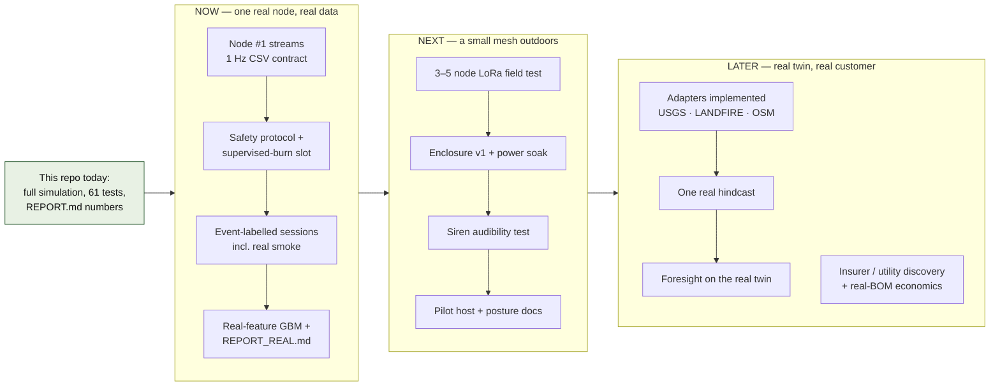

# Emberline roadmap

Sequenced from the gap register ([04_GAP_REGISTER.md](04_GAP_REGISTER.md)).
Every step names the **artifact that proves it**; a step without its artifact
is not done. Nothing below has been started in code unless marked. Dates are
given only where the team supplied them (competition calendar, *team
context*); everything else is ordered, not scheduled.

Source: [diagrams/roadmap.mmd](diagrams/roadmap.mmd).

## Where we are (done, in this repository)

| item | proof artifact |
|---|---|
| End-to-end simulation of sense → classify → mesh → Foresight → CAP draft | `python -m emberline.demo --scenario ridgeline --fast --kill-node N3 --wind-shift 40`; `demo/out/demo.gif` |
| Measured results with regen commands | [REPORT.md](../REPORT.md), `metrics/*.json` |
| 61 passing tests including stress tests (54 original + 7 MVP) | `bash verify.sh` |
| Six pitch figures rendered only from run artifacts | `demo/out/pitch_assets/*.png`, [PITCH_ASSETS.md](../PITCH_ASSETS.md) |
| One-command MVP run and dated summary | `make mvp` → [MVP_RUN.md](MVP_RUN.md) |
| This documentation set | `docs/` |

## NOW — one real node filmed at a supervised burn, real-data GBM

Goal: replace "everything is synthetic" with "one node, real smoke, real
confounders, separately reported". Target: before Pirates Pitch in November
*(team context)*.

| step | what | proof artifact | gap # |
|---|---|---|---|
| N1 | Breadboard node (ESP32-S3 + BME680/688 + PMS5003) streams `ms,pm1,pm25,pm10,gas_ohms,temp_c,rh,press_hpa` at 1 Hz over USB serial | 24-h ambient CSV in `data/real/` (gitignored) with SHA-256 in a manifest; 5-minute screen capture of the stream | 1 |
| N2 | Written safety/ethics protocol; live-burn or prescribed-burn slot with a fire academy or fire company | signed one-page protocol; confirmed date | 18, 15 |
| N3 | Record event-labelled sessions: ambient, bbq, wood_stove, vehicle, fog, aerosol, and smoke at the burn; film the node at the burn | session manifest (kind, duration, placement, conditions) with counts per kind; the film clip | 2 |
| N4 | Implement CSV ingestion + real-feature extractor (PM2.5 mean/max/slope, gas log-ratio vs rolling 10-min baseline, RH/temp means); retrain GBM with session-level split | new package (suggested `emberline/realdata/`) with tests; `REPORT_REAL.md` with precision/recall per confounder and false positives per node-hour, dated, never merged with synthetic tables | 2 |
| N5 | Update the pitch: real clip + real table beside the synthetic one, clearly labelled | revised deck; [00_OVERVIEW.md](00_OVERVIEW.md) "what exists today" updated | — |

Exit criterion for NOW: a fire professional can watch the clip and read one
real precision/recall table.

## NEXT — 3–5 node LoRa field test, enclosure v1, soak test

Goal: replace the radio model and the power assumptions with measurements.

| step | what | proof artifact | gap # |
|---|---|---|---|
| X1 | Add a certified LoRa module to 3–5 nodes; walk-test range over real terrain including a ridge; log RSSI vs distance; measure packet loss; document band/power for Part 15 | RSSI-vs-distance CSV and plot; comparison against `mesh.path_loss_exponent`/`ref_loss_db`; packet-loss table; a log showing one head re-election after pulling a node's power | 3, 14 |
| X2 | Enclosure v1 (teammate's CAD) printed; solar + LiFePO4 sized from measured draw; two-week outdoor soak | battery-voltage trace; drift comparison bare vs enclosed node; measured mA per mode (idle, PM fan, TX, siren) | 4, 5, 7 |
| X3 | Siren/speaker prototype; dB(A) at 10/50/100 m; voice message comprehension with non-team listeners; town notified before any audible test | measurement sheet; listener notes; the notice sent | 6, 14 |
| X4 | Pilot host community (Firewise or fire company) and the routing/liability posture document | letter of support; posture doc reviewed by an adult advisor or counsel | 13, 15 |
| X5 | Re-tune `mesh.escalation.tier0_conf` and the corroboration window from real ambient false-positive rates, on a branch, reported separately | before/after table on real sessions | 2, 7 |

Exit criterion for NEXT: a photograph of five enclosed nodes on a real
hillside, with a radio log to match.

## LATER — pilot community, insurer conversation, real hindcasts, Foresight on a real twin

| step | what | proof artifact | gap # |
|---|---|---|---|
| L1 | Implement `adapters/usgs.py` (3DEP via TNM Access), `adapters/landfire.py` (FBFM40 via LFPS), `adapters/osm.py` (osmnx); keep the array contracts the stubs document | adapter tests against a cached tile; a `World` built for a real place | 10, 11 |
| L2 | One real hindcast: a documented WUI fire with a public timeline, run through the existing harness on the real twin | scenario YAML pointing at real data; harness output reported in `REPORT_REAL.md`, not in the synthetic table | 10 |
| L3 | Compare the CA (and the surrogate) against an operational solver or the documented perimeter on that landscape; retrain the surrogate if the teacher changes | discrepancy report; updated `surrogate.eval` numbers, whichever way they move | 8, 9 |
| L4 | Foresight on the real twin: geodetic CRS in CAP polygons, real road capacities, pre-planned zone routes as the resident-facing default | CAP draft with a real polygon a county tool can open; routing posture applied | 11, 12, 13 |
| L5 | Insurer/utility discovery calls; costed deployable BOM; `economics:` config updated with sourced figures | verbatim call notes; BOM spreadsheet; regenerated economics section | 16, 17 |
| L6 | County EMA conversation about intake (WEA/IPAWS/local sirens); design target is "draft in their inbox" | meeting notes; a mock intake test with their duty officer | 12 |
| L7 | Protocol redesign for multiple incidents once the real packet budget is known | new stress test replacing the pinned limitation | 19 |

Exit criterion for LATER: a pilot community with nodes installed, one real
hindcast, and one named organisation that has said what it would pay.

## Competition calendar *(team context)*

Pirates Pitch (November), Conrad Challenge (Energy & Environment), Blue
Ocean, Diamond Challenge (Social Innovation), SXSW EDU Student Impact
Challenge. The NOW block is aimed at the first of these; every later block
is presented as planned work with its status label.

---

Previous: [04_GAP_REGISTER.md](04_GAP_REGISTER.md). Next:
[06_GLOSSARY.md](06_GLOSSARY.md).
